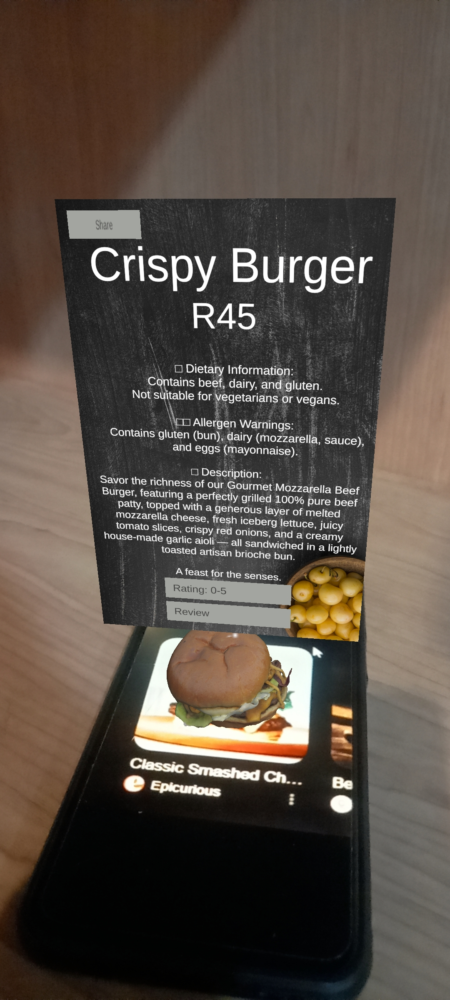

# 🍔 AR Restaurant Menu App

An Augmented Reality (AR) application designed to help restaurants showcase their menu items in an interactive, engaging, and modern way.

## 🌟 Features

- 📱 **Image Target Recognition**: Point your camera at an image to view a 3D model of the food item.
- 🍰 **AR Visualization**: See realistic 3D dishes in real space using AR Foundation.
- 🎉 **Celebratory Particle Effects**: Confetti effect when showcasing special items like cake or desserts.
- ⭐ **Customer Reviews (optional)**: Let customers rate and leave feedback on dishes.
- 🌐 **Cross-Platform Support**: Built with Unity and AR Foundation for Android & iOS.

## 🛠️ Tech Stack

- Unity (C#)
- AR Foundation
- Vuforia or Unity’s AR Subsystems
- TextMeshPro
- Custom Particle Systems

---

## 📝 How to Use

1. Download the .apk file and launch the app.
2. Scan the designated image target for a food item(the images are in the Images folder).
3. The 3D dish model will appear in your real-world space.
4. 🎉 Confetti plays for celebration items like cake!
5. Tap to view full **description**, **dietary info**, and **price**.

---
